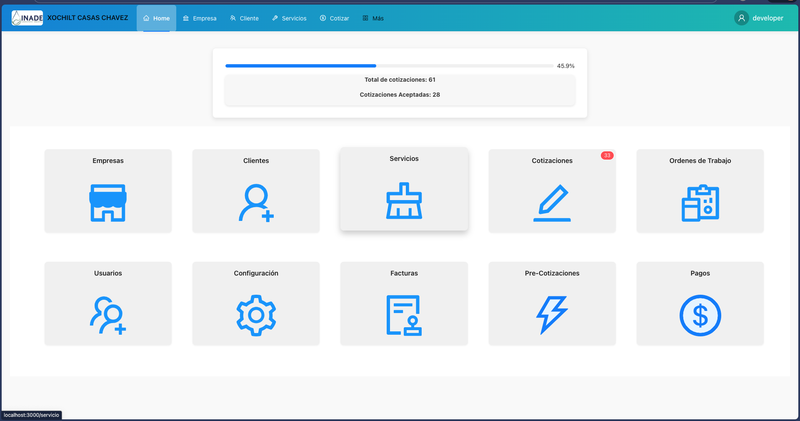
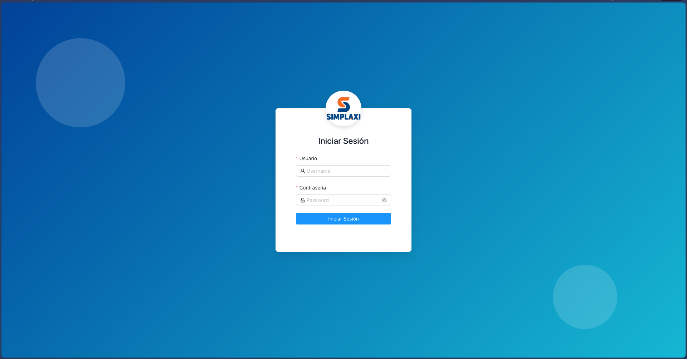
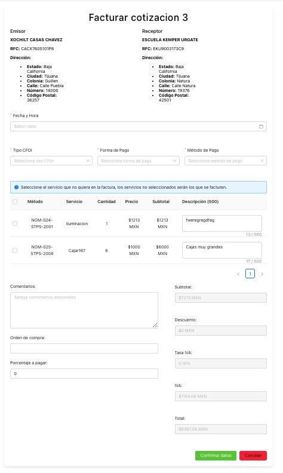
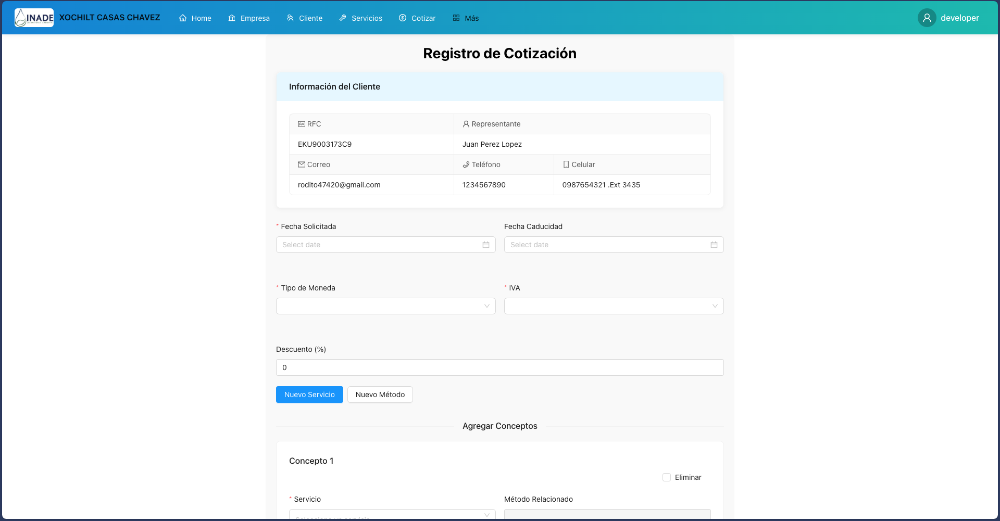
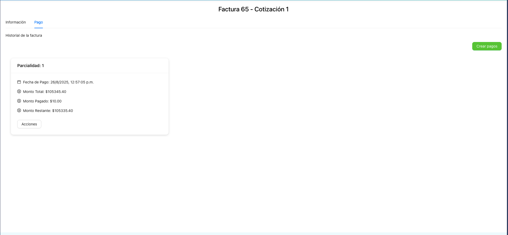

<p align="center">
  
</p>

<h1 align="center">💼 Sistema de Cotización y Facturación – INADE</h1>

<p align="center">
  
  
  
</p>

---

## 🧾 Descripción general

En este repositorio se desarrolla **todo el diseño del sistema web de cotización y facturación de INADE**, implementado con **Ant Design** y tecnologías modernas de React.

El sistema abarca desde la **creación de empresas y clientes**, hasta la **generación de cotizaciones y facturas**, permitiendo agregar servicios personalizados, editar cotizaciones existentes y mantener un flujo dinámico adaptable ante cualquier cambio por parte del cliente.

**Este cotizador se llama [Simplaxi](https://www.simplaxi.com/)**  

---

## 🖼️ Vistas del sistema

### 🏠 Lobby principal


### 🔐 Pantalla de inicio de sesión


### 🧾 Creación de factura


### 📋 Registro de cotización


### 💳 Sección de pagos


---

## ⚙️ Tecnologías utilizadas

- **React.js** – Framework principal del front-end  
- **Ant Design** – Componentes UI elegantes y profesionales  
- **HTML5 / CSS3 / JavaScript (ES6+)**  
- **Git & GitHub** – Control de versiones  
- **Axios / Fetch API** – Comunicación con el backend  
- **React Router DOM** – Navegación entre secciones  

---

## 🚀 Ejecución local

Para ejecutar el proyecto en tu entorno local:

```bash
# Clonar el repositorio
git clone https://github.com/AdrianITT/Frontendwix.git

# Entrar al directorio del proyecto
cd Frontendwix

# Instalar dependencias
npm install

# Ejecutar el servidor en modo desarrollo
npm start
```


---

## 👤 Autor

**Adrián I.T.**  
💻 Desarrollador Frontend | UI/UX Enthusiast  
📧 [adriancvtj@gmail.com](mailto:adriancvtj@gmail.com)  


---

> _“Construido con pasión por la mejora continua y el detalle visual.”